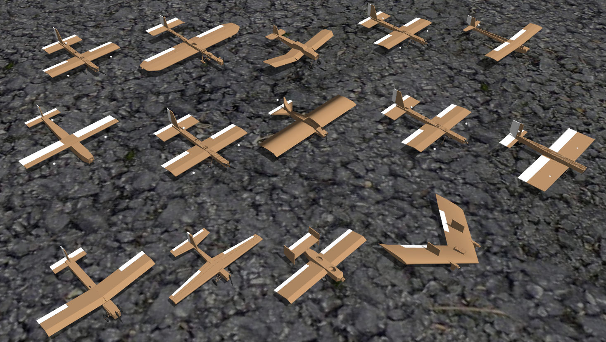

# Fixedwing Gazebo
Gazebo fixedwing models. Created as part of AAE 451, Spring 2020.



## Build

```bash
mkdir -p ~/catkin/src
cd ~/catkin/src
git clone https://github.com/jgoppert/fixedwing_gazebo.git
git clone --recursive --branch sitl_twin https://github.com/jgoppert/Firmware.git px4
ln -s px4/Tools/sitl_gazebo mavlink_sitl_gazebo
cd ~/catkin
catkin init
catkin build
. ./devel/setup.bash
```
## Launch

### Flyable Vehicles
 * miniscout
 * mini_fixedwing_01
 * mini_fixedwing_02
 * mini_fixedwing_03
 * mini_fixedwing_04
 * mini_fixedwing_05
 * mini_fixedwing_06
 * mini_fixedwing_07
 * mini_fixedwing_08
 * mini_fixedwing_09
 * mini_fixedwing_10
 * mini_fixedwing_11
 * mini_fixedwing_12
 * mini_fixedwing_13
 * mini_fixedwing_14

Most vehicles are single engine and can be run with:

```bash
roslaunch fixedwing_gazebo px4.launch vehicle:=mini_fixedwing_01
```

For the twin engine (mini_fixedwing_04), we will need to tell it to use the twin engine startup script.

```bash
roslaunch fixedwing_gazebo px4.launch vehicle:=mini_fixedwing_01 script:=plane_twin
```

<!--  vim: set et fenc=utf-8 ff=unix sts=0 sw=2 ts=2 :  -->
